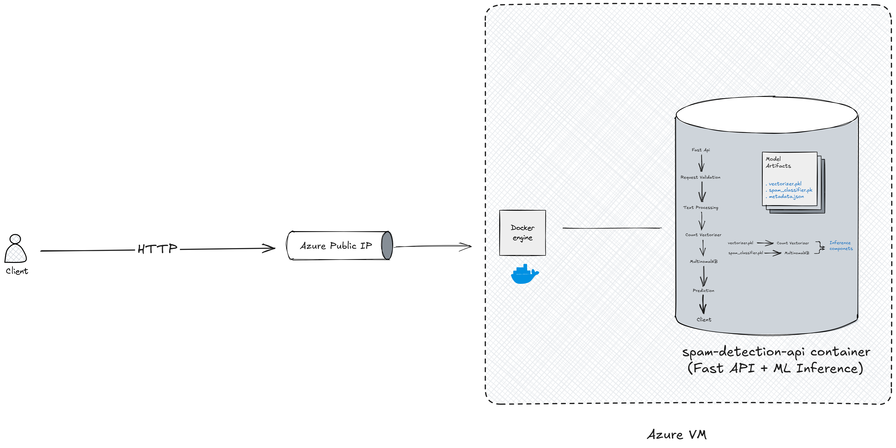
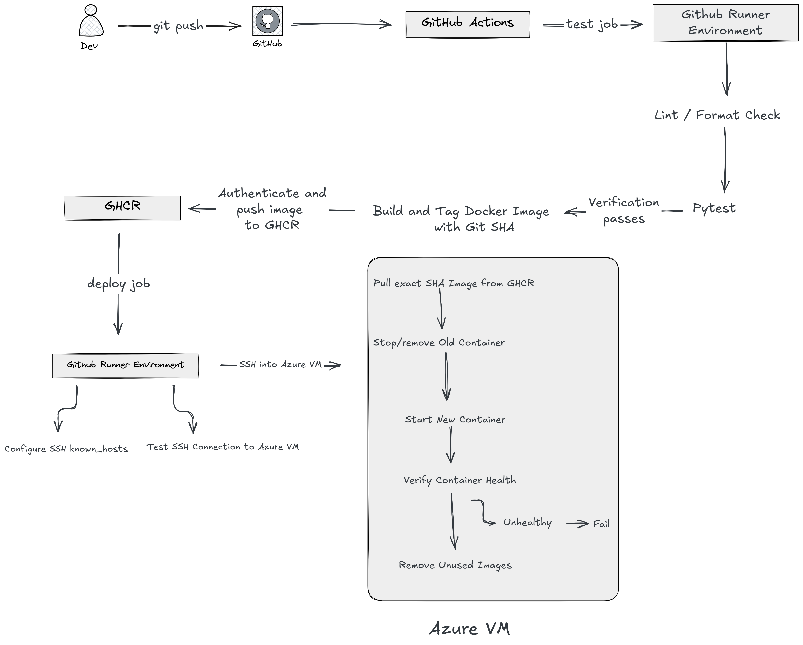

# Spam-Detection-API 

Spam Detection API is a production-oriented machine learning service that exposes a trained spam classification model through a FastAPI REST API. The application packages the model and preprocessing pipeline into a Docker image and uses GitHub Actions to automatically test, build, publish, and deploy new versions to an Azure virtual machine.

---

## Tech Stack 

- **Python**
- **FastAPI**
- **scikit-learn**
- **NLTK**
- **Docker**
- **GitHub Actions**
- **GitHub Container Registry**
- **Azure VM**
- **pytest**
- **Ruff**

## Architecture 
### Runtime

### CI / CD 


--- 

## ML Approach 

- **Dataset**: The service was trained using the popular SMS Spam Collection dataset, which contains 5,574 messages labelled as either spam or ham (not spam). The dataset is imbalanced, with significantly more ham messages than spam messages. Although dataset imbalance is generally not ideal when building machine learning models, it is acceptable in this case because it reflects real-world conditions, where legitimate messages are far more common than spam messages.

- **Preprocessing**: The preprocessing pipeline was implemented using the NLTK (Natural Language Toolkit) library. Raw SMS messages were first tokenized into individual words (tokens). Common stop words, such as "is", "am", and "the", were then removed to reduce noise and improve the model's ability to learn meaningful patterns from the text. After preprocessing, CountVectorizer was used to convert the cleaned text into a numerical feature matrix by counting the frequency of each word across the dataset. This feature representation enabled the machine learning model to process and learn from the textual data effectively. 

- **Model**: MultinomalNB was utilized in training the service because it is designed to work with word frequency data, whcih is exactly the data type produced from vectorization techniques like  CountVectorizer. The recorded evaluation results are:

```text
                                          precision    recall  f1-score   support

ham               0.99      0.99      0.99      1213
spam              0.94      0.93      0.94       180

accuracy                              0.98      1393
macro avg          0.96      0.96      0.96      1393
weighted avg       0.98      0.98      0.98      1393
```

---

## API

The service exposes REST endpoints for performing spam classification, retrieving model information, and monitoring the health of the application. Interactive API documentation is also automatically generated by FastAPI and is available through the `/docs` endpoint.

### `POST /predict`

Classifies an SMS message as either `spam` or `ham`.

**Request**

```json
{
  "message": "Congratulations! You have won a free prize. Click here to claim it."
}
```

**Response**

```json
{
  "message": "Congratulations! You have won a free prize. Click here to claim it.",
  "prediction": "spam",
  "confidence": 99.9999344796629
}
```

The submitted message is passed through the same preprocessing and vectorization pipeline used during model training before being sent to the trained classifier for inference.

### `GET /model-info`

Returns metadata about the currently deployed machine learning model, such as its model type and evaluation information.

**Example Response**

```json
{
  "algorithm": "MultinomialNB",
  "vectorizer": "CountVectorizer",
  "vocabulary_size": 7429,
  "accuracy": 0.9856424982053122,
  "classification_report": {
    "ham": {
      "precision": 0.9917559769167353,
      "recall": 0.9917559769167353,
      "f1-score": 0.9917559769167353,
      "support": 1213
    },
    "spam": {
      "precision": 0.9444444444444444,
      "recall": 0.9444444444444444,
      "f1-score": 0.9444444444444444,
      "support": 180
    },
    "accuracy": 0.9856424982053122,
    "macro avg": {
      "precision": 0.9681002106805898,
      "recall": 0.9681002106805898,
      "f1-score": 0.9681002106805898,
      "support": 1393
    },
    "weighted avg": {
      "precision": 0.9856424982053122,
      "recall": 0.9856424982053122,
      "f1-score": 0.9856424982053122,
      "support": 1393
    }
  },
  "train_samples": 4179,
  "test_samples": 1393
}
```


### `GET /health`

Provides a lightweight health endpoint used to verify that the API is running and able to respond to requests.

**Response**

```json
{
  "status": "healthy",
  "model_loaded": true,
  "model_algorithm": "MultinomialNB"
}
```

The endpoint is also used by the Docker health check during deployment. GitHub Actions verifies the container's health after starting a new version of the application before considering the deployment successful.

### Interactive Documentation

FastAPI automatically generates interactive OpenAPI documentation for the service:

- Swagger UI: `/docs`
- OpenAPI schema: `/openapi.json`

The Swagger UI can be used to inspect the API contract and test the endpoints directly from a browser.

---

## Project Structure
```
spam-detection-api/
│
├── app/
│   ├── main.py
│   ├── core/
│   ├── model/
│   │   ├── spam_classifier.pkl
│   │   ├── vectorizer.pkl
│   │   └── metadata.json
│   ├── routes/
│   │   ├── __init__.py
│   │   └── routes.py
│   ├── schemas/
│   │   ├── __init__.py
│   │   └── schema.py
│   └── services/
│       ├── __init__.py
│       ├── inference.py
│       ├── model.py
│       └── preprocessing.py
│
├── tests/
│   └── test_predictions.py
│
├── training/
│   ├── spam.csv
│   └── train.py
├── requirements.txt
├── pytest.ini
├── Dockerfile
├── compose.yaml
├── assets/
│   ├── ci-cd.png
│   └── runtime.png
└── .github/
    └── workflows/
        └── ci.yml
```
## Local Development

### Prerequisites 

- Python 3.12+
- Docker
- Git

### Setup 
```bash 
git clone https://github.com/MohOdejimi/spam-detection-api
cd spam-detection-api

# Linux/macOS
python3 -m venv .venv
source .venv/bin/activate

# Windows PowerShell: .venv\\Scripts\\Activate.ps1
# Windows Command Prompt: .venv\\Scripts\\activate.bat

python -m pip install --upgrade pip
python -m pip install -r requirements.txt
python -m training.train
fastapi dev app/main.py
```

## Docker
The API is packaged as a Docker image to provide a consistent runtime environment between development, CI, and production. The image contains the Python runtime, application dependencies, NLTK resources, application code, and trained model artifacts required to serve predictions.

## Continuous Integration (CI)

The CI workflow is triggered whenever code is pushed to the `main` branch. GitHub Actions provisions a GitHub-hosted runner to execute the jobs and steps defined in the workflow.

The pipeline first performs automated code-quality checks using Ruff to identify linting and formatting issues. Once these checks pass, the application is tested using `pytest` to verify its expected behaviour and prevent failing changes from progressing further through the pipeline.

After successful verification, a Docker image containing the application and its dependencies is built. The image is tagged using the Git commit SHA, creating a direct relationship between the source-code revision and the resulting deployment artifact. This makes deployments traceable and allows a specific application version to be identified or rolled back when necessary.

The resulting Docker image is then published to GitHub Container Registry (GHCR), where it becomes available for the deployment stage of the pipeline.

## Continuous Deployment (CD)
After the integration and image publishing stages complete successfully, the deployment job uses SSH to connect securely to the Azure VM. SSH host-key verification is performed using a preconfigured `known_hosts` entry to ensure that the deployment runner is connecting to the expected server.

Once connected, the VM pulls the Docker image associated with the current Git commit SHA from GitHub Container Registry (GHCR). Using the commit SHA ensures that the exact artifact produced by the pipeline is the artifact deployed to the VM.

Before starting the new version, the deployment process checks whether an existing `spam-detection-api` container is present. If one exists, it is stopped and removed before a new container is started from the newly pulled image.

The deployment then waits for the new container's health check and verifies its health status. If the container is unhealthy, the deployment job exits with a failure status. If the health check succeeds, the deployment is considered successful and unused application images are removed from the VM to prevent unnecessary disk usage.

This process allows changes pushed to the `main` branch to move from source code to a verified, containerized deployment without requiring manual intervention on the VM.

## Configuration & Secrets

| Secret | Purpose |
|---|---|
| `AZURE_VM_SSH_KEY` | SSH authentication to the Azure VM |
| `AZURE_VM_USERNAME` | VM login username |
| `AZURE_VM_IP` | VM public IP |
| `AZURE_VM_KNOWN_HOSTS` | Trusted SSH host key used for server verification |

The secrets are stored in Github Actions Secrets and are not commited to the repository in other to avoid abuse and endure security. 